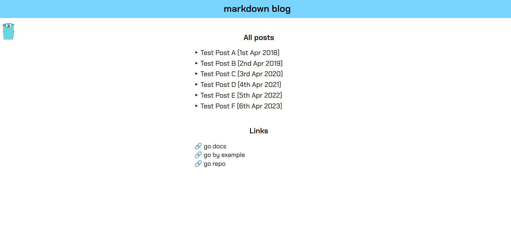
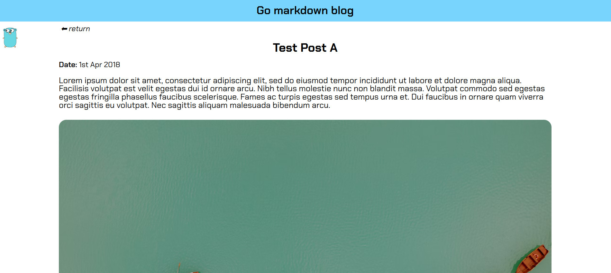
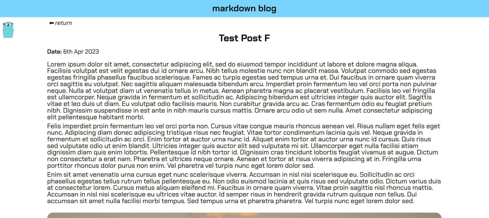
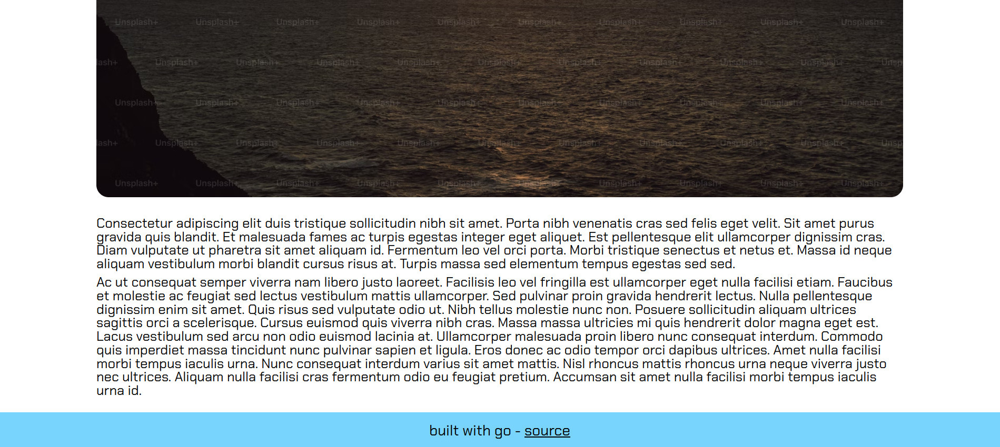

#### About

Минималистичный блог. Статьи формируются путем преобразования md файлов в html

#### Hot to run

1. Запустить make команды:
   - make getdeps
   - make build
   - make start
2. Приложение доступно на порте 9000

#### Screenshots

